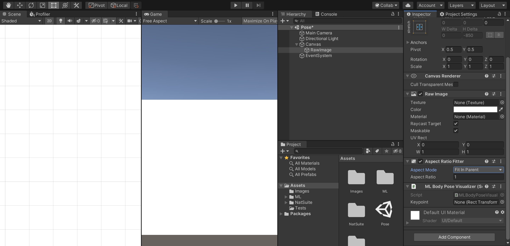
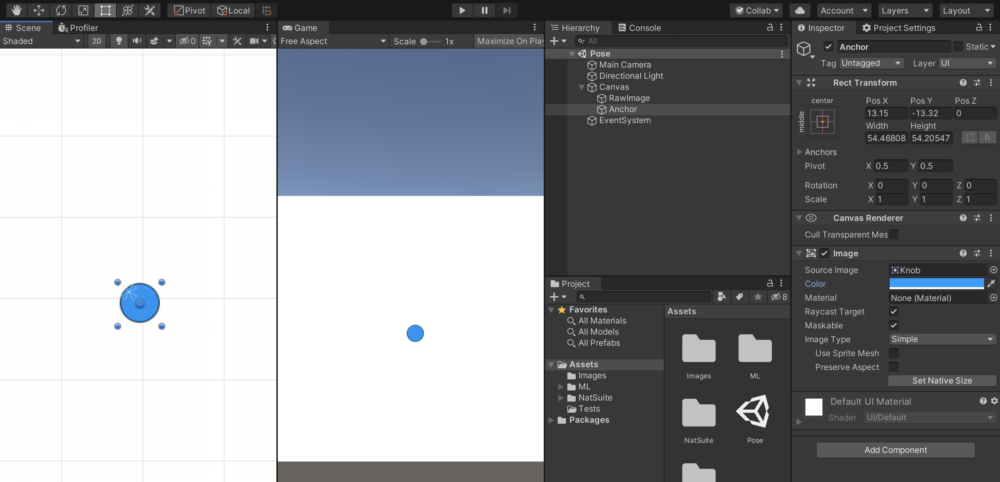
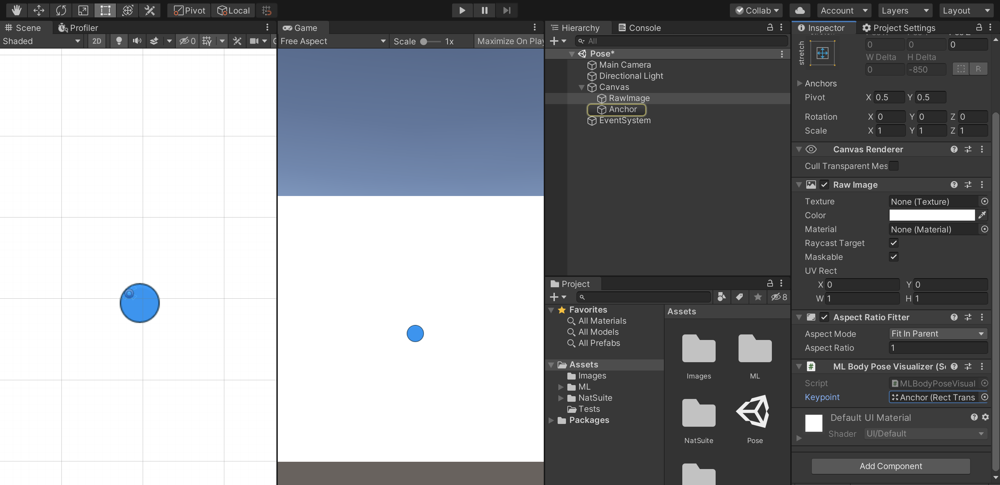

# MoveNet
[MoveNet](https://blog.tensorflow.org/2021/05/next-generation-pose-detection-with-movenet-and-tensorflowjs.html) single body pose detection. This package requires [NatML](https://github.com/natsuite/NatML).

## Detecting Pose in an Image
First, create the MoveNet predictor:
```csharp
// Fetch the model data from Hub
var accessKey = "<HUB ACCESS KEY>"; // Get your access key from https://hub.natsuite.io/profile
var modelData = await MLModelData.FromHub("@natsuite/movenet", accessKey);
// Deserialize the model
var model = modelData.Deserialize();
// Create the MoveNet predictor
var predictor = new MoveNetPredictor(model);
```

Then create an input feature:
```csharp
// Create image feature
Texture2D image = ...;
var input = new MLImageFeature(image);
// Set the normalization and aspect mode
(input.mean, input.std) = modelData.normalization;
input.aspectMode = modelData.aspectMode;
```

Finally, detect the body pose in an image:
```csharp
// Detect the body pose
MoveNetPredictor.Pose pose = predictor.Predict(input);
```

## Visualizing Body Poses
To visualize the detected body pose, we will use Unity UI along with Visualizers included in NatML. First, create a `RawImage` to display our image. Then add a `BodyPoseVisualizer` component:



Next, create a UI `Image` that will serve as anchors to visualize the pose:



Then assign the anchor to the visualizer component:



Finally, we can use the visualizer to render the body pose:
```csharp
public BodyPoseVisualizer visualizer;   // Assign in Inspector

// Visualize
visualizer.Render(image, pose);
```

## Requirements
- Unity 2019.2+
- [NatML 1.0+](https://github.com/natsuite/NatML)

## Quick Tips
- See the [NatML documentation](https://docs.natsuite.io/natml).
- Join the [NatSuite community on Discord](https://discord.gg/y5vwgXkz2f).
- Discuss [NatML on Unity Forums](https://forum.unity.com/threads/open-beta-natml-machine-learning-runtime.1109339/).
- Contact us at [hi@natsuite.io](mailto:hi@natsuite.io).

Thank you very much!